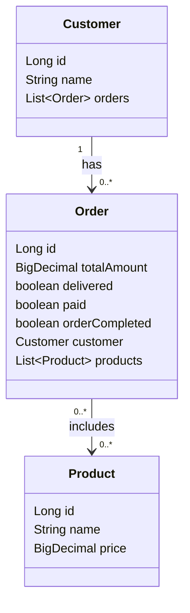

# Bootcamp Santander 2024 - Backend com Java
Java RESTful API criada para o desafio de projeto do Bootcamp Santander 2024 - Backend com Java

## Diagrama de classes:

```mermaid
classDiagram
    class Customer {
        Long id
        String name
        List~Order~ orders
    }
    
    class Order {
        Long id
        BigDecimal totalAmount
        boolean delivered
        boolean paid
        boolean orderCompleted
        Customer customer
        List~Product~ products
    }
    
    class Product {
        Long id
        String name
        BigDecimal price
    }

    Customer "1" --> "0..*" Order : has
    Order "0..*" --> "0..*" Product : includes
```